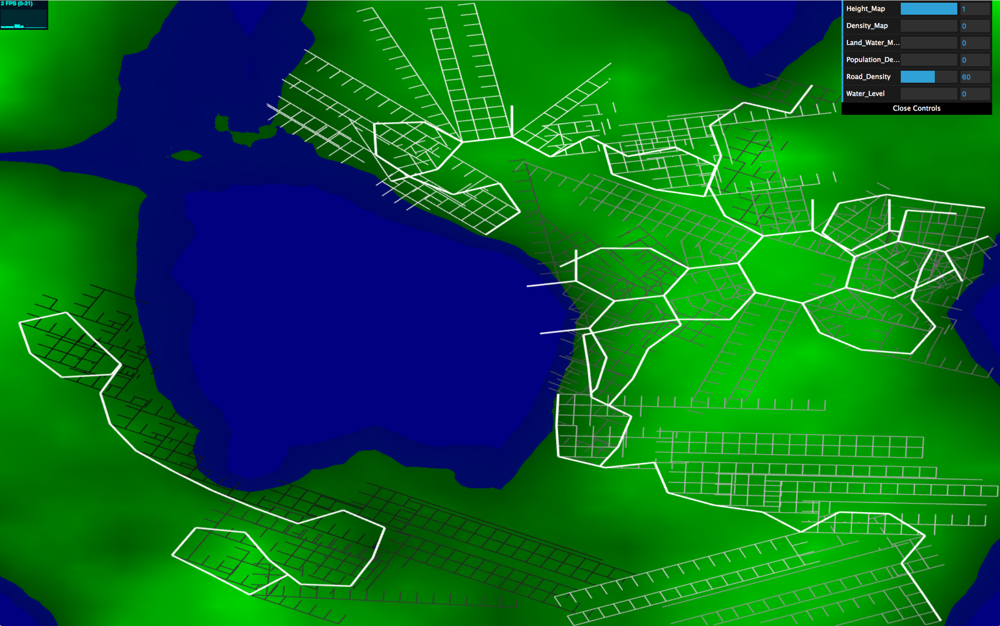
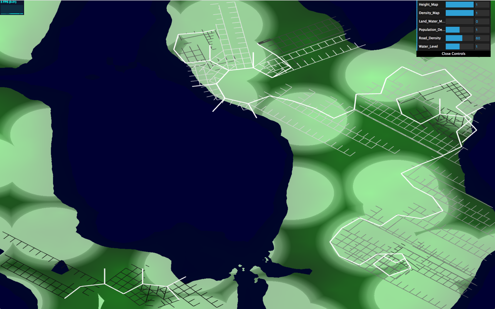
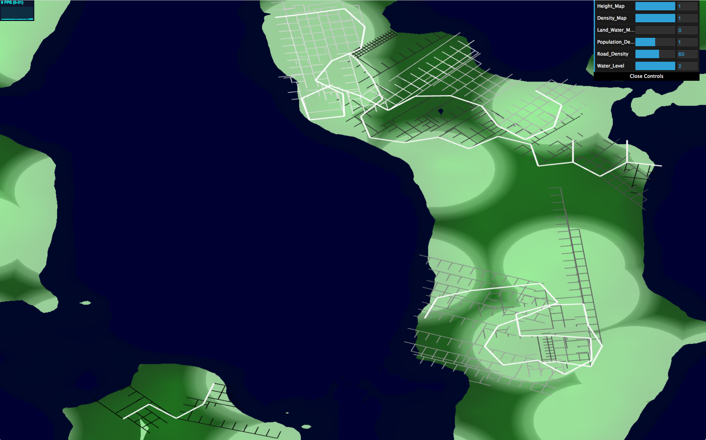
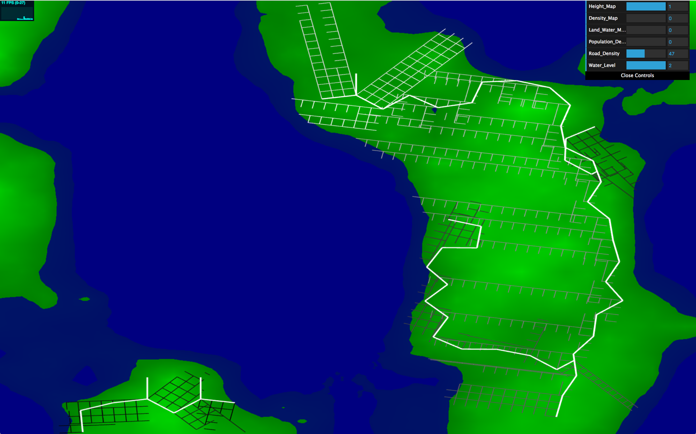

# hw05-road-generation

Evelyn Bailey

ebail

Project: https://eviebail.github.io/hw05-road-generation/

Website: https://evelyn.pb.studio

Features:

System Architecture:

A Note on Functionality: This project is still a work in progress. Not all features are fully working.

Turtle: The turtle class keeps track of the position, orientation, and depth of each road placed in the scene. The orientation is used to rotate the geometry in the same orientation as the forward vector of the Turtle.

TurtleHistory: A stack of turtles that is used to save and remove turtles from the system. This allows the branching effect to be achieved where there are multiple branching paths from the same position. As the system runs, if the Turtle is a branching turtle, it is pushed onto the stack and two paths continue expanding.

ExpansionRule: There isn't an explicit ExpansionRule class; however, the roads expand in a particular pattern. Highways grow towards denser population areas, while smaller streets branch out from each of the highways. Smaller streets can not cross over water, while highways can cross over water if the end of the road touches ground.

RoadSystem: This class is a wrapper class to use each of the aforementioned classes to generate a road network. It first takes the axiom and expands it by accessing the set of rules from its ExpansionRule class for the entire string for a set number of iterations. Once the grammar is built, it then uses the TurtleHistory class to perform the drawing rule selected for each character of the grammar. The turtle's position, orientation, and scale is saved and returned when main calls LSystem's runSystem function.

Main: Main sets up the mesh assets, runs the pseudo-LSystem, and takes RoadSystem's output and passes the information to the VBO. In the VBO, a Translation/Rotation/Scale matrix based on the position/orientation/scale of each turtle is assembled and applied to the vertices of the geometry. I set up a texture that stores the height and population density information and stores in a texture that the RoadSystem uses to determine which direction the roads should grow. The height is calculated using FBM, while the population density is a combination of worley and fbm.

A Note on Rendering: This project uses instanced rendering, where a mesh or object is created once and drawn multiple times. This is accomplished by keeping track of the number of instances to be drawn and setting up instanced variables like vs_Translate and vs_Scale that have a separate value for each instance of the object.

Customizations:

There are three aspects you can change about the tree. You can change the population density distribution, the height of the water, and how dense the roads are.

Collaborators:
For this project, I worked with fellow classmate Grace to work through the algorithms.

Sample Images:
 

